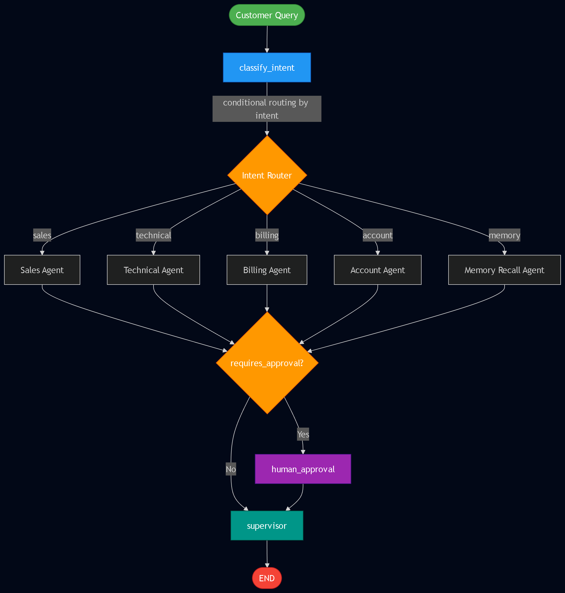
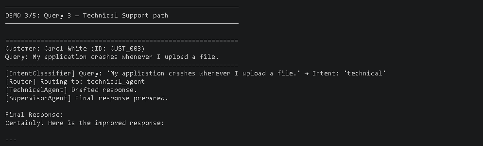
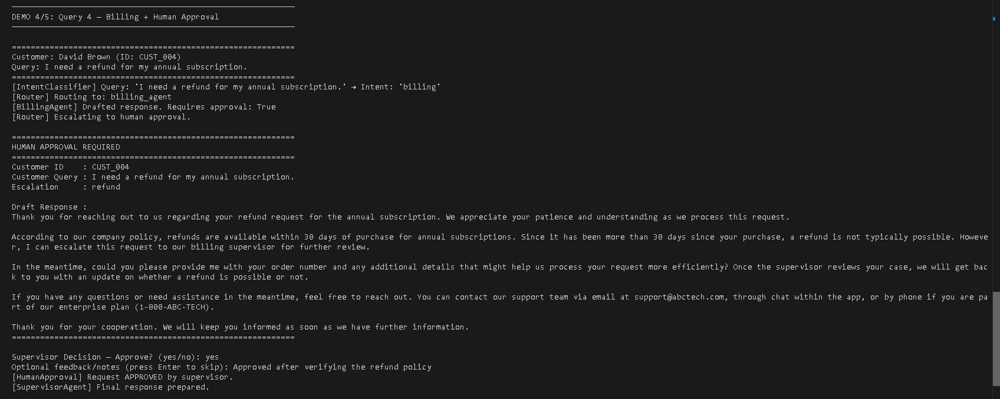
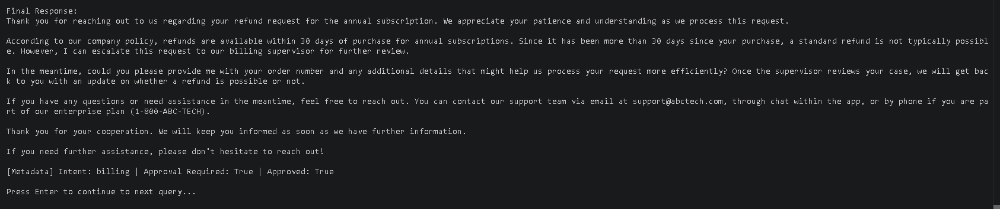

<div align="center">
*GithubRepo:* https://github.com/Jai-2077/customer_support_system

# 🤖 ABC Technologies
### AI-Powered Customer Support Automation System

[](https://langchain-ai.github.io/langgraph/)
[](https://www.langchain.com/)
[](https://ollama.com/)
[](https://www.trychroma.com/)
[](https://www.sqlite.org/)
[](https://www.python.org/)

*A multi-agent customer support orchestration system powered by LangGraph, RAG, and persistent memory.*

</div>

---

## 📑 Table of Contents

- [Overview](#-overview)
- [Project Structure](#-project-structure)
- [Setup Instructions](#️-setup-instructions)
- [Running the System](#️-running-the-system)
- [LangGraph Workflow](#-langgraph-workflow)
- [Demo Queries](#-demo-queries--routing)
- [Screenshots](#-screenshots)
- [Key Features](#-key-features)
- [Summary](#-summary)

---

## 🌟 Overview

This project implements an **enterprise-grade AI customer support system** for ABC Technologies, featuring:

> 🧠 **Smart routing** • 📚 **RAG-powered knowledge** • 💾 **Persistent memory** • 👤 **Human oversight** • ✅ **Quality supervision**

---

## 📁 Project Structure

```
customer_support_system/
├── 🚀 main.py                  # Entry point (demo + interactive)
├── 🔗 graph.py                 # LangGraph workflow (Tasks 1, 4)
├── 📦 state.py                 # State structure (Task 2)
├── 🛠️  init_db.py              # One-time setup: DB + vectorstore
├── 📄 schema.sql               # SQLite schema
├── 📋 requirements.txt
├── 🔐 .env.example
│
├── 📂 agents/
│   ├── intent_classifier.py    # Task 3 — Intent classification
│   ├── support_agents.py       # Task 5 — 4 specialized agents + memory
│   ├── human_approval.py       # Task 8 — Human-in-the-loop
│   └── supervisor_agent.py     # Task 9 — Supervisor review
│
├── 📂 rag/
│   └── rag_pipeline.py         # Task 6 — RAG with ChromaDB
│
├── 📂 memory/
│   └── sqlite_memory.py        # Task 7 — SQLite conversation memory
│
├── 📂 docs/
│   ├── company_policy.txt
│   ├── pricing_guide.txt
│   ├── technical_manual.txt
│   └── faq.txt
│
└── 📂 screenshots/             # Demo output screenshots
```

---

## ⚙️ Setup Instructions

<details open>
<summary><b>Step 1: Install Dependencies</b></summary>

```bash
pip install -r requirements.txt
```
Installs LangGraph, LangChain, Ollama integration, ChromaDB, and text splitters.
</details>

<details open>
<summary><b>Step 2: Start Ollama & Download Models</b></summary>

```bash
# Start the Ollama server
ollama serve
```

In a new terminal:
```bash
ollama pull qwen2.5:7b
ollama pull nomic-embed-text
```

*(Optional)* Configure environment:
```bash
cp .env.example .env
```
</details>

<details open>
<summary><b>Step 3: Initialize Database & Vector Store</b></summary>

```bash
python init_db.py
```

This creates:
- 💾 `memory.db` — SQLite conversation memory  
- 🧬 `chroma_db/` — Vector embeddings for RAG  
</details>

---

## ▶️ Running the System

| Mode | Command | Description |
|------|---------|-------------|
| 🎬 **Demo** | `python main.py --demo` | Runs 5 predefined customer queries |
| 💬 **Interactive** | `python main.py --interactive` | Live chat with the support system |

---

## 🧠 LangGraph Workflow

<p align="center">
  
</p>

---

## 🧪 Demo Queries & Routing

| # | 💬 Customer Query | 🎯 Routed To | 🔐 Approval |
|:-:|------------------|--------------|:-----------:|
| 1 | *"Pricing plans?"* | Sales Agent | — |
| 2 | *"Forgot password"* | Account Agent | — |
| 3 | *"App crashes on file upload"* | Technical Support Agent | — |
| 4 | *"Need a refund for annual subscription"* | Billing Agent | ✅ |
| 5 | *"What was my previous issue?"* | Memory Recall Agent | — |

---

## 📸 Screenshots

<details open>
<summary><b>🛠️ Database Initialization</b></summary>

> Running `python init_db.py` to set up SQLite + ChromaDB.

<p align="center">
  
</p>
</details>

<details open>
<summary><b>💰 Query 1 — Sales Inquiry (Pricing Plans)</b></summary>

<p align="center">
  
</p>
</details>

<details open>
<summary><b>👤 Query 2 — Account Management (Forgot Password)</b></summary>

<p align="center">
  
</p>
</details>

<details open>
<summary><b>🔧 Query 3 — Technical Support (App Crash)</b></summary>

<p align="center">
  
  <br/><br/>
  
</p>
</details>

<details open>
<summary><b>💳 Query 4 — Billing with Human Approval (Refund Request)</b></summary>

**Step 1 — Agent Response & Approval Trigger**
<p align="center">
  
</p>

**Step 2 — Final Response After Approval**
<p align="center">
  
</p>
</details>

<details open>
<summary><b>🧠 Query 5 — Memory Recall (Previous Issue Lookup)</b></summary>

<p align="center">
  
</p>
</details>

---

## 🚀 Key Features

<table>
<tr>
<td width="50%" valign="top">

### 🎯 Intent Classification
Powered by **Ollama (`qwen2.5:7b`)** — classifies into:
- 💰 Sales
- 🔧 Technical Support
- 💳 Billing
- 👤 Account Management
- 🧠 Memory Recall

</td>
<td width="50%" valign="top">

### 📚 Retrieval-Augmented Generation
**ChromaDB** retrieves contextual chunks from:
- 📋 Company Policy
- 💲 Pricing Guide
- 📖 Technical Manual
- ❓ FAQ Knowledge Base

</td>
</tr>
<tr>
<td width="50%" valign="top">

### 💾 Persistent SQLite Memory
- Stores **full conversation history**
- Per-customer context tracking
- Enables intelligent memory recall

</td>
<td width="50%" valign="top">

### 👥 Human-in-the-Loop
CLI approval required for:
- 💸 Refunds
- ❌ Subscription cancellations
- 🔒 Account closures
- 🎁 Compensation requests

</td>
</tr>
<tr>
<td colspan="2" valign="top">

### 🎯 Supervisor Agent
A **final quality-review layer** that validates, refines, and polishes every response before it reaches the customer — ensuring tone, accuracy, and policy compliance.

</td>
</tr>
</table>

---

## 📌 Summary

This system showcases a **production-grade multi-agent AI customer support architecture** built on LangGraph, integrating:

| Capability | Implementation |
|-----------|---------------|
| 🔀 **Conditional Routing** | LangGraph state-based intent routing |
| 📚 **Knowledge Retrieval** | RAG with ChromaDB + nomic-embed-text |
| 💾 **Persistent Memory** | SQLite-backed conversation history |
| 👥 **Human Oversight** | CLI-based approval gates |
| 🎯 **Quality Control** | Supervisor agent review layer |

> 🏗️ *Designed for modularity, scalability, and real-world deployment readiness.*

---

<div align="center">


</div>